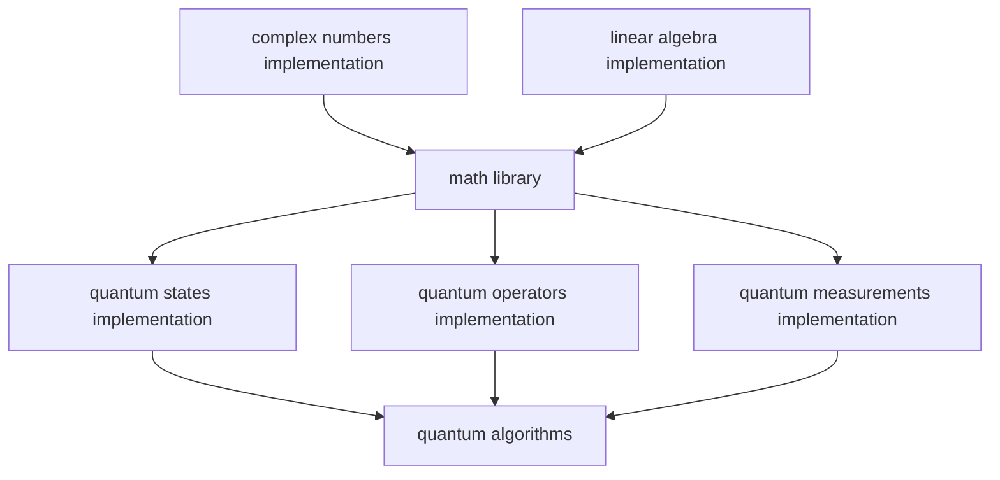
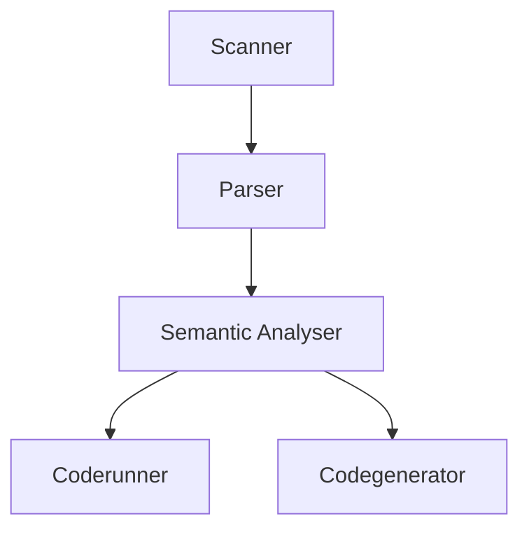

<p align="center">
  
</p>

# The Q-bit project
## About
### What is Q-bit?
  **Q-bit** is a quantum simulator project containg the following parts:
   - a **quantum computer simulator** and its **Q-SET** instruction set
   - a first of its kind **quantum circuit-like assembly language**, called **Q Assembly**
   - an **automated scope-based dynamic memory management system** written in C, named **SMART**

### The Q-bit quantum computer simulator
  #### **About**
   - the **Q-bit quantum computer simulator** enables you to run **quantum** algorithms and logic on **classical** computers
   - it also gives the ability to combine **quantum computer logic** with **classical computer logic**
   - it defines a **quantum computer instruction set** [(**Q-SET**)](#q-set) which can be directly used as a C **library**

  #### **Structure**
   - the base of the **Q-bit quantum computer simulator** is the **linear algebra** implementation
   - the **math library** defines **complex numbers**, **complex matrices**, **complex vectors** and **mathematical operations** on them
   - on top of that are created the **quantum states**, **quantum operators** and **quantum measurements** implementations
   - everything is then combined in a static **library**

  Below is a visual representation of the structure of the **Q-bit quantum computer simulator**:

  #### **Types**
   - `struct complex` - a type representing **complex numbers**
   - `struct matrix` - a type reprsenting N-dimensional **complex matrices**
   - `vector` - a special case of a N-rows one-column **complex matrix**
   - `dual_vector` - a special case of a one-row N-columns **complex matrix**
   - `quantum_state` - a `vector` type describing the state of a N-qubit **quantum system** in Hilbert space
   - `qubit` - a special case of a two-dimensional `quantum_state` reprsenting a **qubit**
   - `quantum_operator` - a `struct matrix` type describing a **quantum operator**
   - `quantum_gate` - a special case of a `quantum_operator` describing a **quantum gate**
   - `qm_result` - a standalone type which holds the result of a **quantum measurement**: a **quantum state** and a **classical bit** value
   - `quantum_measurement_result` - a more explicit version of the `qm_result` type

> [!NOTE]
> The base types in the simulator are the `struct complex` and `struct matrix` types from the math library. Every other type derives from them _(except for the `qm_result` and `quantum_measurement_result` types)_. That way the type system is explicit but also allows for seamless integration between the linear algebra functions and the quantum operations.

  #### **Q-SET**
   - for the creation of the quantum simulator an **instruction set** had to be developed - **Q-SET**
   - **Q-SET** includes **all** the necessary **mathematical** and **quantum** operations a **quantum computer** has to be able to perform
   - the **functions** in the implementation of the quantum simulator are essentially the **Q-SET** **instructions** the simulated **quantum computer** executes

  #### **Usage**
   - the quantum simulator can be used in **C** and **C++** after including the `qbit.h` header file and linking the `libqbit.a` static library
   - to learn more about the building process, read the [Build section](#build)

  #### **Example**
```C
short algorithm_deutsch(const quantum_gate * const gate) {
    if(!gate) return -1;
    if(gate->rows != 4 || gate->rows != gate->columns) return -1;

    // |0>
    qubit *register_0 = qubit_create();

    // H
    quantum_gate *hadamard = quantum_gate_create_hadamard();

    // |-> = H * |1>
    qubit *register_h_minus = matrix_mul(
        hadamard, 
        qubit_create_init(complex_create(0, 0), complex_create(1, 0))
    );

    register_0 = matrix_mul(
        hadamard, 
        register_0
    );
    quantum_state *combined = matrix_tensor_product(
        register_0, 
        register_h_minus
    );
    combined = matrix_mul(gate, combined);

    // The gate which applies a Hadamard gate only to the first qubit is U = H ⊗ I
    quantum_gate *hadamard_control_qubit = matrix_tensor_product(
        hadamard, 
        quantum_gate_create(2)
    );
    combined = matrix_mul(hadamard_control_qubit, combined);

    // A way of computing the result by measuring the whole system
    /*
    qm_result *result = quantum_state_measure(combined);
    printf("\nDeutch algorithm measurement result state: \n");
    matrix_print(result->state);
    if(result->value < 2) return 0;
    return 1;
    */

    // A way of computing the result by measuring only the first qubit
    qm_result *result = quantum_state_measure_subsystem(combined, 0, 2);
    printf("\nDeutch algorithm measurement result state: \n");
    matrix_print(result->state);
    return result->value;
}
```
### Q Assembly
  #### **About**
   - **Q Assembly** is a first of its kind quantum circuit-like assembly language
   - it is designed for the **Q-bit quantum computer simulator**
   - it runs on the **Q-SET** instruction set
   - also, **Q Assembly** incorporates some parts _(although not many)_ from [**Quark**](https://github.com/dr-programmer/quark), making it the first language of the **Quark family**

  #### **Purpose**
   - **Q Assembly** makes it easier to implement **quantum circuits** as its grammar is **specifically designed** for them
   - it is much more **readable** and **easier to understand** than a full-blown **Q-SET** instructions file
   - **Q Assembly** boasts a **fully modular** compiler design, which is **perfect** for **future quantum computer languages** to use as a **core** and build **new features** **on top**
   - it also gives a **great middle ground** for **higher level quantum computer languages** to use as an **intermediate representation**

> [!NOTE]
> More conventional classical computer-like higher level quantum computer languages are better off directly using **Q-SET** instructions.

  #### **Structure**
   1. **Scanner** → "Scans" the given **file** and creates and returns all the **tokens**, which are the words of the language _(If an invalid token is reached, it returns an error)_
      - Written in **flex**
   2. **Parser** → "Parses" the **tokens** _(the output of the Scanner)_, applies **syntax checks** and structures them in a large data structure - **Abstract Syntax Tree**, also refered to as **AST**
      - Written in **bison**
   3. **Semantic Analyser** → "Analyses" the **AST**, performes **name resolution** using a **symbol table** _(implemented with a stack of hash tables)_ and applies **math type checking** _(essentially checking whether linear algebra and quantum operations are applied to operands of correct dimensions)_
      - Written in **C**
   4. **Coderunner** → Converts the **Q Assembly** instructions to **Q-SET** instructions and **runs** them directly on the **Q-bit quantum computer simulator**
      - Written in **C**
   5. **Codegenerator** → Generates a **Q-SET** instructions **file** from the **Q Assembly** instructions and **compiles** it to an **executable file**, which **can** be run **without** the simulator on **any** classical computer
      - The **Q-SET** instructions file is also left out. This enables for **seamless integration** and **development** between **Q Assembly** and **Q-SET**.
      - Written in **C**

  Below is a visual representation of the structure of the **Q Assembly** compiler:

> [!TIP]
> If the `compile_time_calculations` flag is enabled, the **Codegenerator** can run the **Coderunner** for some parts of the program. Read more about about [The Q-bit CLI](#the-q-bit-cli)

  #### **Usage**
   - the **Q Assembly** language file extension is `.qsm`
   - after creating your **Q Assembly** quantum program, it can be run with the `qbit` executable
   - learn more about [The Q-bit CLI](#the-q-bit-cli)

  #### **Example**
```
?? Defining the quantum gates, used in the quantum circuit.
I (
    1, 0, 
    0, 1
)

X (
    0, 1, 
    1, 0
)

H (
    1 / #2, 1 / #2, 
    1 / #2, -(1 / #2)
)

PARAM_GATE ( 
        |0>*<0| @ (I) + |1>*<1| @ (X)
)

?? Creating the quantum registers and then applying each step of the quantum circuit to them.
{ 
        {1 | 0}                 ?? The same as |0>
        {1 / #2 | -1 / #2}      ?? The same as (H)*|1> → in quantum physics: the Hadamard minus state, |->
}
         -> (H)@(I)[0 ... 1]    ?? The same as: (H)[0] && (I)[1] and (H)[0]
         -> (PARAM_GATE)
         -> (H)[0]
         -> <[0 ... 1]
         -> <[0]
```
### SMART
  #### **About**
   - **SMART** is an **automated dynamic memory management system**
   - it uses a newly developed **scope-based** system, so it is very **fast** and **efficient**
   - it is written in **C** for **C**

  #### **Purpose**
   - **SMART** **removes** the worry of **memory leaks** in any **C** program
   - it is very **easy** and **straightforward** to use
   - despite all the **automations**, if needed, it also has more **barebones features**, but with added **protection** against e.g. **double free** and **null free**

  #### **Usage**
   - **SMART** can be used in C and C++ after including the `smart_allocation.h` or `qbit.h` header files and linking either the `smart_allocation.c.o` object file or the static library `libqbit.a`
   - to learn more about the building process, read the [Build section](#build)

  #### **Syntax**
  **SMART** uses a set of **functions** and **preprocessor macros** to invoke its **intrinsic functions**, listed below:

  Always defined:
   - `smart_allocate(num, size)` → **allocates** the desired amount of memory; the syntax resembles that of the built in `calloc` function
   - `smart_free(ptr)` → **frees** the given pointer _(and all its children)_ and has protections against e.g. **double free** and **null free**

  If `SMART_DEALLOCATION` **is** defined before including the `smart_allocation.h` header file:
   - `S` → defines the start of a **new memory allocation scope**
     - calls the intrinsic function `void smart_allocation_stack_push();`
   - `E` → defines the **end of a scope**; when it is reached, all allocated variables inside that specific scope will be freed
     - calls the intrinsic function `void smart_allocation_stack_pop();`
   - `P(PTR)` → defines a special feature of **SMART** - it **'promotes'** a given pointer to a **higher scope level** so when its original scope is freed that pointer will still be allocated
     - calls the intrinsic function `int smart_allocation_promote_ptr(const void * const ptr);`
   - `B(PAR, CHILD)` → defines another special feature of **SMART** - it **'binds'** a **child pointer** to a **parent** so that whatever happens to the parent is applied to the child as well; this is very useful for big data structures with many pointer fields, beacause if all the fields are bound to the main structure pointer, then when promoting or freeing the data structure, only the main pointer has to be promoted/freed
     - calls the intrinsic function `int smart_allocation_bind_ptr(const void * const par, const void * const child);`
   - `C` → **cleans** all the scope levels and **all** memory is **deallocated**; useful when exiting a prorgam in the middle of the execution - the programmer doesn't need to worry about how many scope levels where allocated until now
     - calls the intrinsic function `void smart_allocation_stack_clean();`

> [!TIP]
> If `SMART_DEALLOCATION_EXPLICIT` is defined after `SMART_DEALLOCATION`, then `S` is converted to `START`, `E` to `END`, `P(PTR)` to `PROMOTE(PTR)`, `B(PAR, CHILD)` to `BIND(PAR, CHILD)` and `C` to `CLEAN`.

  If `SMART_DEALLOCATION` is **not** defined before including the `smart_allocation.h` header file:
   - `smart_allocation_setup()` → **creates** a single **scope** where all the memory is **allocated**
   - `smart_allocation_free()` → **frees** the entire **global scope** at the end of the program and **all memory** is freed

> [!NOTE]
> Even when `SMART_DEALLOCATION` is **not** defined **SMART** allocates in a single global scope level that is **compatible** with the features from `SMART_DEALLOCATION`. That way, in a single project, different files can have different allocation strategies but still be compatible with each other in the end. However, in most cases, it is advised to use `SMART_DEALLOCATION` in order to have a broader feature set.

  #### **Logging**
  **SMART** can **display** its **internal behaviour** by **defining** the following **preprocessor macros** in the `smart_allocation.h` header file:
   - `SMART_ALLOCATION_SHOW_PTR_CREATION`
   - `SMART_ALLOCATION_SHOW_SEARCH`
   - `SMART_ALLOCATION_SHOW_PROMOTION`
   - `SMART_ALLOCATION_SHOW_BINDING`
   - `SMART_ALLOCATION_SHOW_END_FREE`
   - `SMART_ALLOCATION_SHOW_ALLOCATION`
   - `SMART_ALLOCATION_SHOW_SMART_FREE`

  #### **Example**
```C
#define SMART_DEALLOCATION
#include "smart_allocation.h"

#include <stdio.h>
#include <stdlib.h>

struct matrix *matrix_create(const unsigned int rows, const unsigned int columns) {
    struct matrix *temp = (struct matrix *)smart_allocate(1, sizeof(struct matrix));
    temp->rows = rows;
    temp->columns = columns;
    temp->fields = (struct complex **)smart_allocate(rows, sizeof(struct complex *));
    B(temp, temp->fields)            // 'Binds' the temp->fields pointer to temp
    for(unsigned int i = 0; i < rows; i++) {
        temp->fields[i] = (struct complex *)smart_allocate(columns, sizeof(struct complex));
        B(temp, temp->fields[i])     // 'Binds' the temp->fields[i] pointer to temp
        temp->fields[i][i % columns] = complex_create(1, 0);
    }
    return temp;
}

int main() {
S            // Creates an allocation scope
    int *a = (int *)smart_allocate(10, sizeof(int));
    if(!a) {
        C    // Cleans all the allocation scopes and all memory is freed
        exit(0);
    }
    S        // Creates an allocation scope
        struct matrix *m = matrix_create(2, 2);
        m = matrix_add(m, matrix_create(2, 2));
        P(m) // 'Promotes' the pointer m and all its children to a higher-level scope
    E        // Signifies the end of an allocation scope and all memory in it is freed
    smart_free(a);    // Frees the pointer a and all its children
    smart_free(a);    // Won't yield an error because smart_free() has double free protection
    smart_free(NULL); // Won't yield an error because smart_free() has null free protection
E            // Signifies the end of an allocation scope and all memory in it is freed
    return 0;
}
```

## Build
### Build dependencies
The following **must** be **installed** in order to **build** the **Q-bit project**:
  - `gcc`
  - `make`
  - `flex`
  - `bison`
  - `git`

### Build on Linux
 1. Install the dependencies

    ```console
    sudo apt-get install build-essential flex bison git
    ```

> [!IMPORTANT]
> Make sure to run `sudo apt-get update` and then `sudo apt-get upgrade` before installing any of the dependencies.

 2. Clone the **Q-bit** github repository in your desired location:

    ```console
    git clone https://github.com/dr-programmer/qbit.git
    ```

 3. Head to the **Q-bit** directory:

    ```console
    cd qbit
    ```

 4. Build the project:

    ```console
    make
    ```

> [!NOTE]
> The `make` command creates the `./build` **directory** which contains all the **object files**, the static **library** and the **executable**. The **directory structure** inside `./build` is **the same** as that of the **source directory**. Read more about [The Build directory]().

 5. Build the **Q-bit** static library:

    ```console
    make build-lib
    ```

 6. Add the following lines at the end of your `~/.bashrc` file:

    ```bash
    export PATH=$PATH:[path-to-qbit]/qbit/build
    export LIBRARY_PATH=$LIBRARY_PATH:[path-to-qbit]/qbit/build
    ```

## The Q-bit CLI
### Basic usage
```console
qbit [--flags] filename.qsm [--flags]
```
> [!TIP]
> If you run the **qbit executable** without any **flags** and **file names**, **qbit** will run its test programs.

### Flags
  - `filename.qsm` - **Q-bit** will _coderun_ the provided **Q Assembly** file. Read more about [The Coderunner](#structure-1).
  - `-gen-qset [executable filename]` - Tells the **Q Assembly** compiler to generate a **Q-SET** instructions file from the previously provided **Q Assembly** file and then converts it to an executable. Read more about [The Codegenerator](#structure-1).
  - `--fast-run` - An additional specifier to the `-gen-qset [executable filename]` flag which enables the internal `compile_time_calculations` flag that tells the **Q Assembly** compiler to run the **Coderunner** on the definitions of all the **quantum gates** and **quantum registers**, and run the **Codegenerator** only on the **quantum circuit** itself.
  - `--show-pcode` - Tells the **Q Assembly** compiler to **structure** and **print** the parsed code back from the **AST** memory structure into **Q Assembly** form. Read more about [The Abstract Syntax Tree](#structure-1).

> [!TIP]
> **Q-bit** uses a convention which implies that **flags** starting with `-` **require** an additional **specifier** after them, and **flags** with `--` **do not**.
