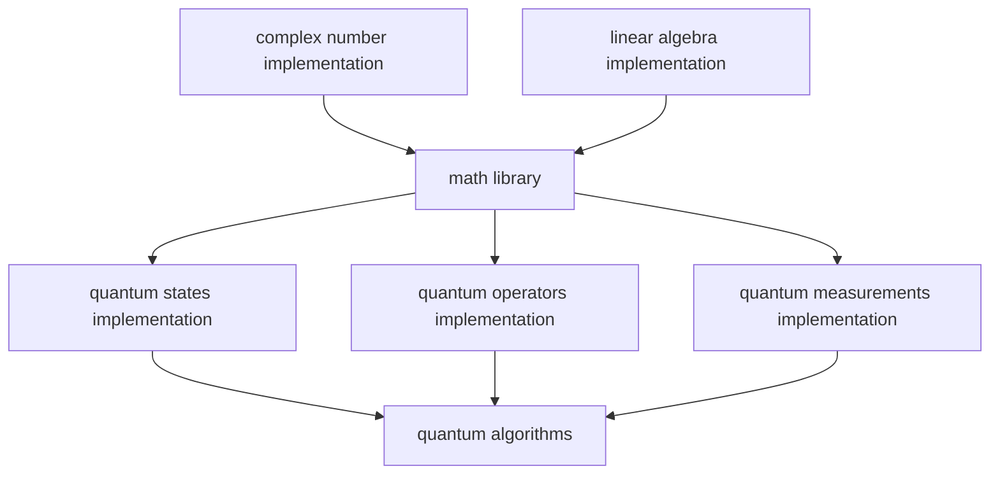
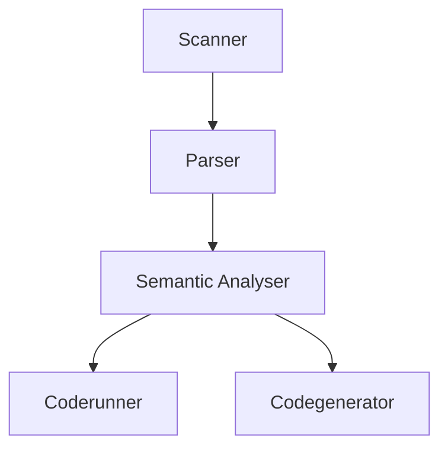

# The Q-bit project
## About
### What is Q-bit?
  Q-bit is a quantum simulator project containg the following parts:
   - a quantum computer simulator and its Q-SET instruction set
   - a first of its kind quantum circuit-like assembly language, called Q Assembly
   - an automated scope-based dynamic memory management system written in C

### The Q-bit quantum computer simulator
  #### **About**
   - the Q-bit quantum computer simulator enables you to run **quantum** algorithms and logic on **classical** computers
   - it also gives the ability to combine **quantum computer logic** with **classical computer logic**
   - it defines a **quantum computer instruction set** [(**Q-SET**)](#q-set) which can be directly used as a C **library**

  #### **Structure**
   - the base of the Q-bit quantum computer simulator is the **linear algebra** implementation
   - the **math library** defines **complex numbers**, **complex matrices**, **complex vectors** and **mathematical operations** on them
   - on top of that are created the **quantum states**, **quantum operators** and **quantum measurements** implementations
   - everything is then combined in a static **library**

  Below is a visual representation of the structure of the Q-bit quantum computer simulator:

  #### **Types**
   - `struct complex` - a type representing **complex numbers**
   - `struct matrix` - a type reprsenting N-dimensional **complex matrices**
   - `vector` - a special case of a N-rows one-column **complex matrix**
   - `dual_vector` - a special case of a one-row N-columns **complex matrix**
   - `quantum_state` - a `vector` type describing the state of a N-qubit **quantum system** in Hilbert space
   - `qubit` - a special case of a two-dimensional `quantum_state` reprsenting a **qubit**
   - `quantum_operator` - a `struct matrix` type describing a **quantum operator**
   - `quantum_gate` - a special case of a `quantum_operator` describing a **quantum gate**
   - `qm_result` - a standalone type which holds the result of a **quantum measurement**: a **quantum state** and a **classical bit** value
   - `quantum_measurement_result` - a more explicit version of the `qm_result` type

> [!NOTE]
> The base types in the simulator are the `struct complex` and `struct matrix` types from the math library. Every other type derives from them _(except for the `qm_result` and `quantum_measurement_result` types)_. That way the type system is explicit but also allows for seamless integration between the linear algebra functions and the quantum operations.

  #### **Q-SET**
   - for the creation of the quantum simulator an instruction set had to be developed - **Q-SET**
   - **Q-SET** includes all the necessary mathematical and quantum operations a quantum computer has to be able to perform
   - the functions in the implementation of the quantum simulator are essentially the **Q-SET** instructions the simulated quantum computer executes

  #### **Usage**
   - the quantum simulator can be used in C and C++ after including the `qbit.h` header file and linking the `libqbit.a` static library
   - to learn more about the building process, read the [Build section]()

### Q Assembly
  #### **About**
   - **Q Assembly** is a first of its kind quantum circuit-like assembly language
   - it is designed for the Q-bit quantum computer simulator
   - it runs on the **Q-SET** instruction set

  #### **Purpose**
   - **Q Assembly** makes it easier to implement quantum circuits as its grammar is specifically designed for them
   - is is much more readable and easier to understand than a full-blown **Q-SET** instructions file
   - it also gives a great middle ground for higher level quantum computer languages to use as an intermediate representation

> [!NOTE]
> More conventional classical computer-like higher level quantum computer languages are better off directly using **Q-SET** instructions.

  #### **Structure**
   1. **Scanner** --> "Scans" the given file and creates and returns all the tokens which are the words of the language _(If an invalid token is reached, it returns an error)_
      - Written in **flex**
   2. **Parser** --> "Parses" the tokens _(the output of the Scanner)_, applies syntax checks and structures them in a large data structure - **Abstract Syntax Tree**, also refered to as **AST**
      - Written in **bison**
   3. **Semantic Analyser** --> "Analyses" the AST, performes name resolution using a symbol table _(implemented with a stack of hash tables)_ and applies math type checking _(essentially checking whether linear algebra and quantum operations are applies to operands of correct dimensions)_
      - Written in **C**
   4. **Coderunner** --> Converts the **Q Assembly** instructions to **Q-SET** instructions and runs them directly on the Q-bit quantum simulator
      - Written in **C**
   5. **Codegenerator** --> Generates a **Q-SET** instructions file from the **Q Assembly** instructions and compiles it to an executable file, which can be run wihtout the simulator on any classical computer
      - The **Q-SET** instructions file is also left out. This enables for seamless integration and development between **Q Assembly** and **Q-SET**.
      - Written in **C**

  Below is a visual representation of the structure of the **Q Assembly** compiler:

> [!TIP]
> If the `compile_time_calculations` flag is enabled the **Codegenerator** can run the **Coderunner** for some parts of the program. Read more about about [The Q Assembly CLI]()
